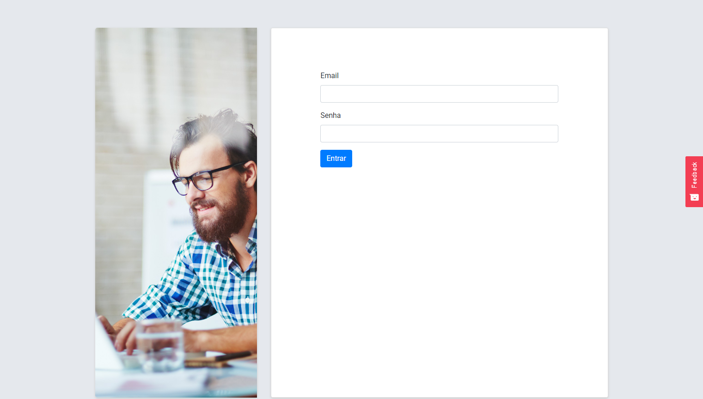
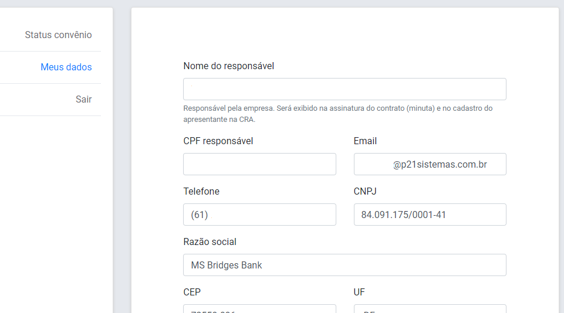

# Página de acompanhamento

A página de acompanhamento serve para verificar o status da solicitação de cadastro na CRA.

Deve ser informado o e-mail e a senha do responsável operacional.

Na página também é possível alterar os dados informados no pré-cadastro.

