# Plataforma de Convênios na CRA

### **Pré-cadastros**

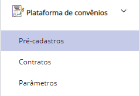

No menu Pré-cadastros, a CRA gerencia as solicitações de novos convênios.\
É possível filtrar as solicitações, por status, situação, razão social e CNPJ.

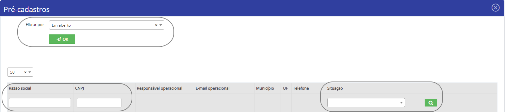

Os status apresentados no filtro descrevem como está o andamento da solicitação:

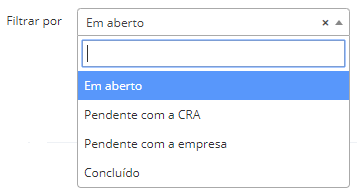

Todas as solicitações que não possuem os status “Conveniado" e “Cancelado" são consideradas Em aberto.

É possível controlar a quantidade de itens apresentados na tela (1).

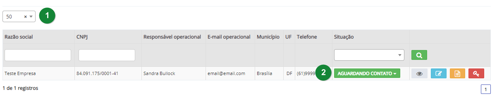

Para prosseguir com o cadastro do convênio, clicar na situação do pedido (2).

O sistema apresenta os seguintes botões:

<table data-header-hidden><thead><tr><th width="150"></th><th></th><th></th></tr></thead><tbody><tr><td></td><td>Ver</td><td>Visualiza as informações cadastradas pela empresa no pré-cadastro.</td></tr><tr><td></td><td>Alterar</td><td>Altera os dados cadastrados</td></tr><tr><td></td><td>Anotações</td><td>Insere observações</td></tr><tr><td></td><td>Documentos</td><td>Mostra os documentos inseridos pela empresa, para realizar download e analisar</td></tr><tr><td></td><td>Resetar senha</td><td>Reseta a senha de acesso a página de acompanhamento. A nova senha será igual ao login (e-mail do responsável operacional cadastrado).</td></tr></tbody></table>

**Situações da solicitação:**

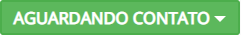

Foi realizado o cadastro inicial e agora a CRA entrará em contato com a empresa.

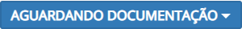

A CRA já fez contato com a empresa e passou algumas informações sobre as condições para a empresa enviar títulos pela CRA e a negociação foi concluída.

A empresa preencherá os dados necessários e os documentos que serão analisados pela CRA. Confirmar o endereço para envio do instrumento de protesto, informar uma conta bancária para repasse dos títulos pagos, e a documentação (Contrato social, Documentos do(s) sócio(s) (CPF/RG) e em caso de representante legal anexar também a Procuração).

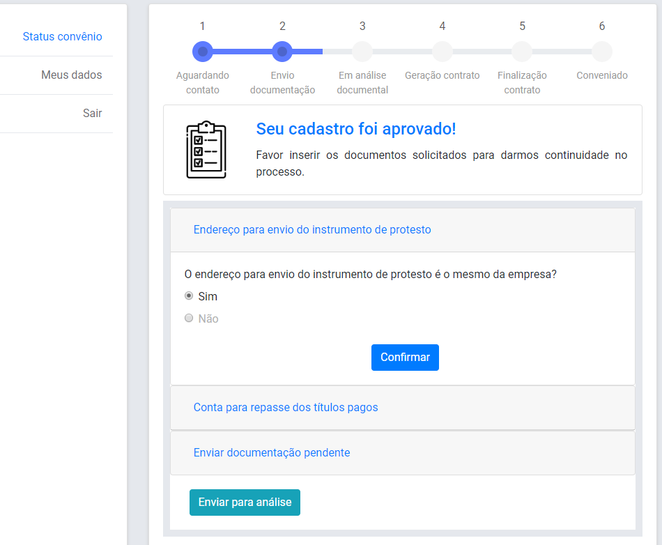

O status do cadastro é atualizado automaticamente para “Em análise documental” assim que a empresa conclui o preenchimento dos campos e o envio dos documentos.

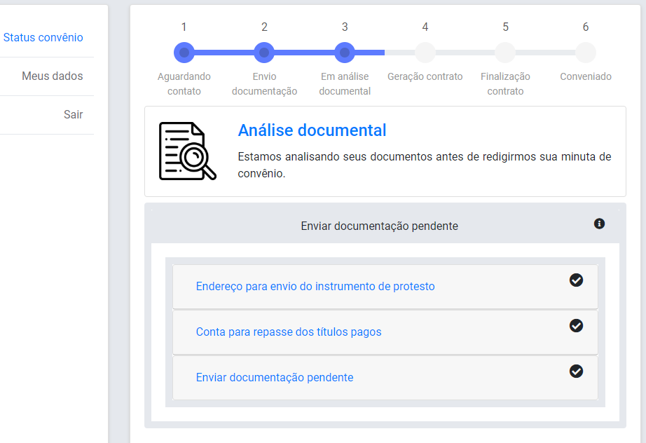

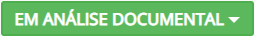

Em análise documental: foram captados os documentos da empresa e dos sócios, e agora a CRA analisará a documentação.\
Nesse momento a CRA clica em Alterar (), e informa o Contrato, a taxa CRA, Código do Convênio, Login e Momento Cobrança.

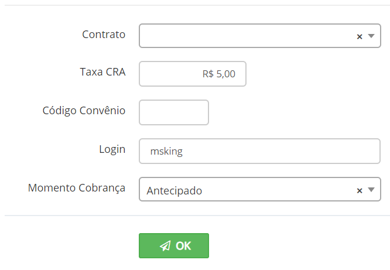\
\*Os contratos a serem apresentados, serão os cadastrados no menu Plataforma de Convênios > Contratos.

Aguardando (do conveniado) a via do contrato do termo de convênio assinada, digitalmente ou fisicamente, que será enviada para a CRA.

Ao selecionar a próxima situação, o sistema solicita confirmar o Contrato e a taxa CRA.

Para a empresa, o sistema informa que a minuta está pronta e que já pode ser baixada. Através do menu “Plataforma de convênios -> Parâmetros” é possível informar o parâmetro “Envio do contrato” que indica se a empresa poderá enviar o contrato por meio físico, eletrônico ou ambos. Esse parâmetro modificará a mensagem que será enviada para a empresa.

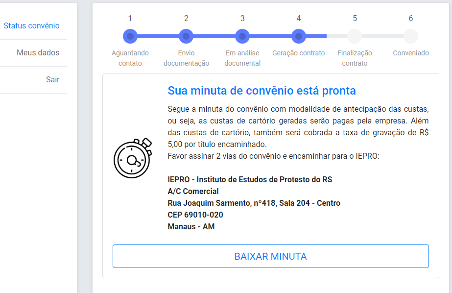

<figure><figcaption></figcaption></figure>

Contrato recebido pelo instituto. A CRA acerta os últimos detalhes do convênio e devolve a via do contrato assinada se tiver sido enviada pela empresa por meio físico.

**Para o apresentante:**

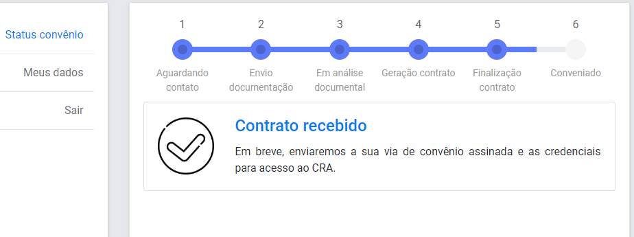

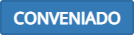

O convênio é cadastrado na CRA com todos os dados informados no pré-cadastro, mas como um apresentante inativo. O apresentante poderá iniciar o envio de títulos pelo sistema assim que a CRA ativar seu cadastro.

A CRA informa o nome de usuário para login na CRA e o código do convênio.

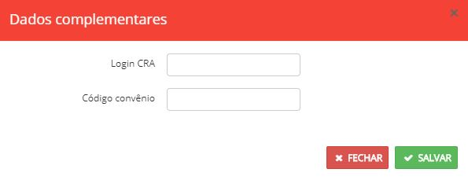

Após salvar, o apresentante recebe a seguinte tela:

Na visão da CRA a tela será redirecionada para a configuração do apresentante dentro do CRA21.\
A cada nova etapa que avançar um novo formulário será apresentado. É possível controlar as etapas que serão preenchidas desmarcando-as.

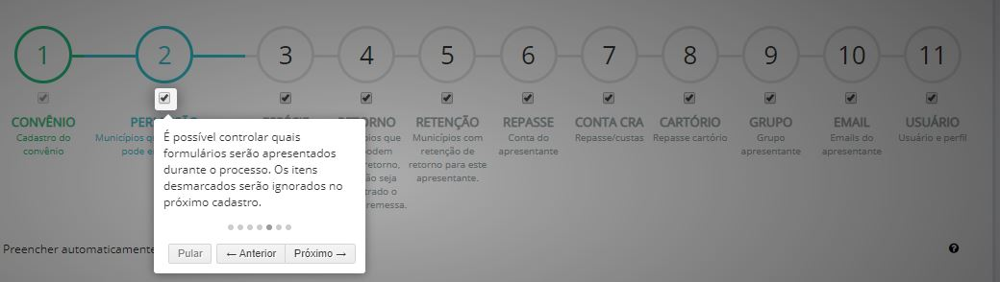

Quando a gestão financeira não for pela CRA, as etapas “CONTA CRA” e “CARTÓRIO” serão ignoradas.

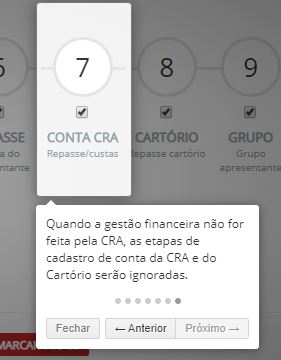

Para agilizar o processo, é possível preencher o formulário automaticamente, por etapa, com os dados do cadastro anterior.

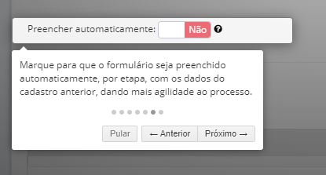

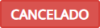

Não houve acordo entre a CRA e a empresa. Em qualquer momento antes da efetivação do convênio é possível cancelar o processo de pré-cadastro.\
O sistema apresenta uma janela para confirmar o cancelamento.

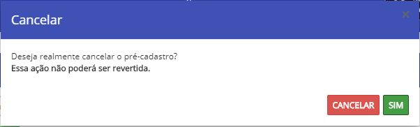

Após a CRA marcar o cancelamento, o apresentante recebe a seguinte **mensagem**:

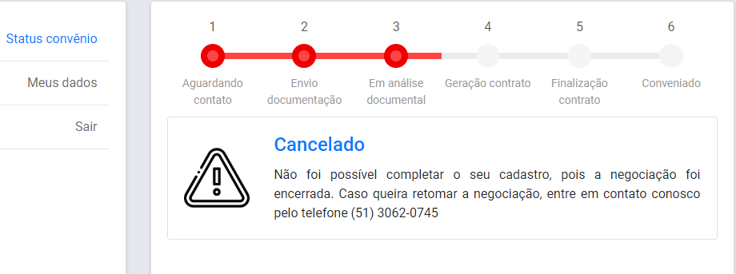
