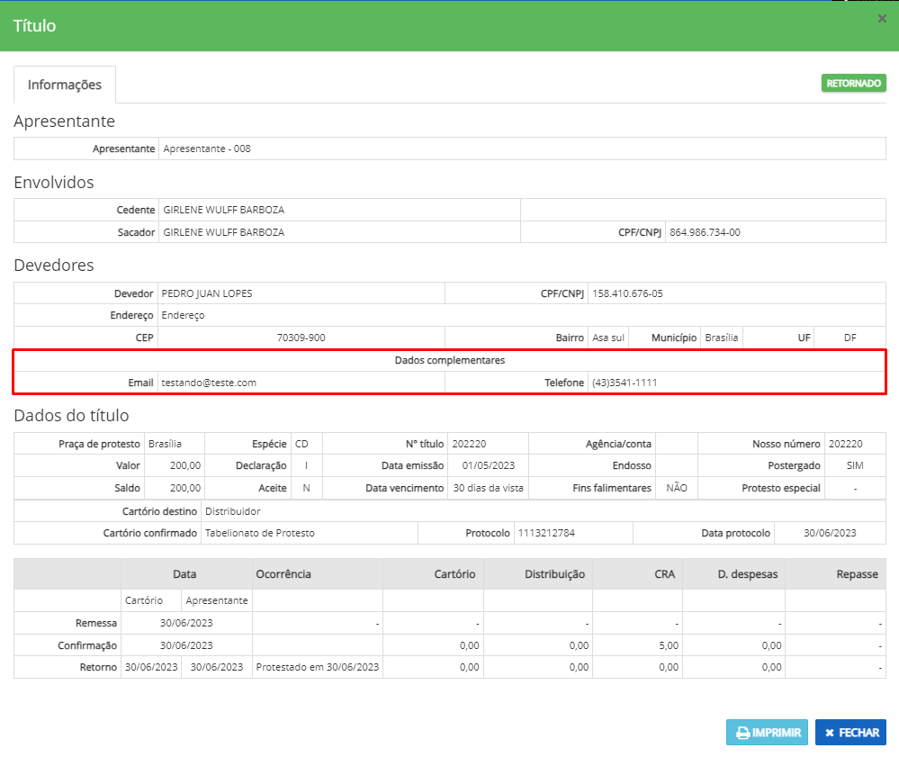

# Consulta de título

A consulta de título é utilizada para pesquisar títulos enviados à CRA. As informações referentes ao título estarão disponíveis nesta tela.

É possível saber também em qual cartório o título se encontra e qual é a situação do título na CRA como: _ENVIADO, DEVOLVIDO, CONFIRMADO_ ou _RETORNADO_.

 (1).png>)

Para visualizar as demais informações referentes ao título como: data de confirmação, data de retorno, custas do título ou valores de repasse, basta clicar no ícone. 

.png>)

E possível também fazer a impressão da ficha do título(utilizado por cartórios), basta clicar no ícone 

O título pode ter associado a ele imagens digitalizadas do título físico. Para inserir uma imagem no título ou consultar a imagem, basta clicar no ícone .\

 (1) (1).png>)
