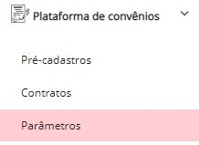
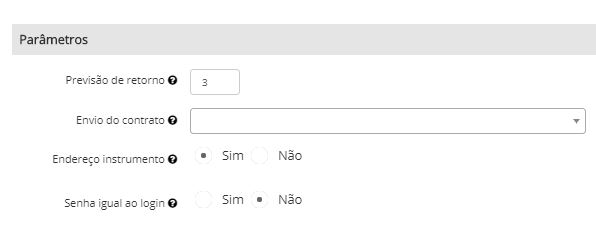

# Paramêtros

No menu “Parâmetros” a CRA poderá personalizar algumas opções:

**Previsão de retorno:** A previsão poderá ser personalizada e a mensagem será apresentada para a empresa conforme definido no parâmetro.

&#x20;****&#x20;

**Envio de contrato:**  Poderá ser físico, eletrônico ou ambos. Caso seja físico, o sistema apresentará para a empresa uma mensagem com o endereço para enviar o contrato. Caso contrário será informado o e-mail para onde a empresa deve encaminhar e neste caso será necessário cadastrar o e-mail no Menu: Parâmetros > CRA > E-mail comercial

**Endereço instrumento:** Informe se a empresa deverá informar um endereço para o recebimento dos instrumentos de protesto. Caso essa opção esteja marcada como sim o apresentante deverá informar se o endereço para envio do instrumento de protesto é o mesmo da empresa.

Se o endereço for diferente, um formulário será disponibilizado para que ele informe o endereço.

**Senha igual ao login:** Informe senha será igual ao login no cadastro do usuário do convênio do CRA21.

&#x20;****&#x20;

**Anexos**

A CRA poderá inserir documentos, que serão disponibilizados para download e um link, na última etapa do pré-cadastro.

