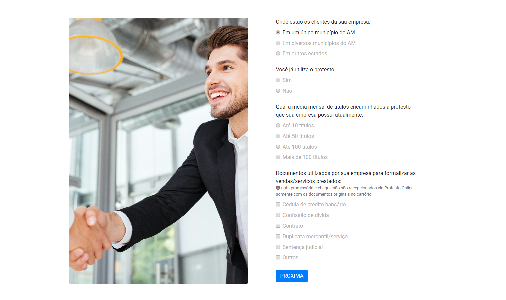
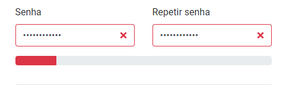
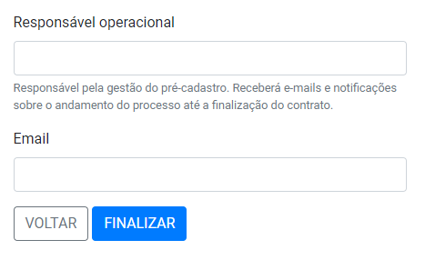

# Pré cadastro

As empresas que querem se tornar conveniadas, realizarão um pré-cadastro no site do Instituto, onde serão captados os seguintes dados: Destino do título, volume de títulos e espécie.

Após o primeiro preenchimento, serão solicitados os dados específicos da empresa.\
(O nome do responsável será exibido na assinatura do contrato e no cadastro do apresentante na CRA)\

Se o nível da senha for fraco, o sistema impede de continuar com o cadastro.\
O recomendado é que possua ao menos 1 caractere maiúsculo, letras e números, e não seja números em sequência.

O campo responsável operacional é preenchido com os dados da pessoa responsável pela negociação e gestão do contrato do convênio. O seu e-mail será utilizado para acessar a plataforma e receber os e-mails sobre o andamento do processo, até a finalização do contrato.

Ao clicar em finalizar, o usuário é redirecionado para a [página de acompanhamento](https://manual.crabr.com.br/manual/plataforma-de-convenios/?preview\_id=2468\&preview\_nonce=5a66fd7a1a\&post\_format=standard&\_thumbnail\_id=-1\&preview=true#pre-cadastro). Que informa o status atual da solicitação.

